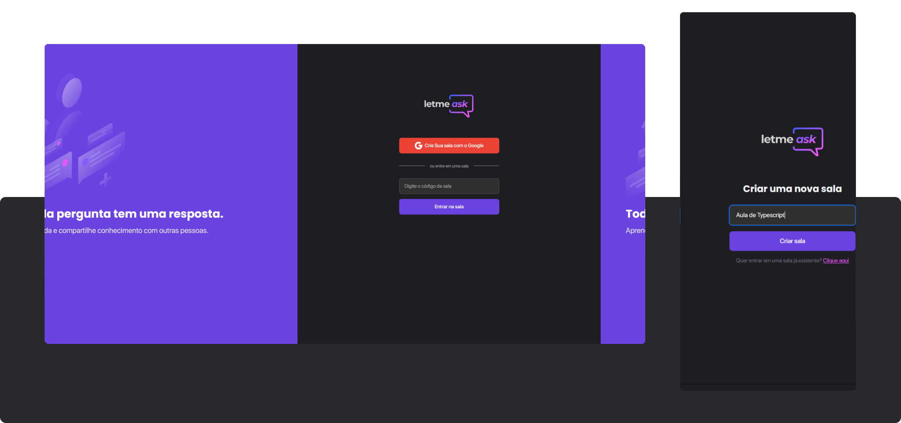

# 🚀 NEXT LEVEL WEEK "LETMEASK" - MISSION REACT

This is an application designed so that people with an audience can open a room to remove possible doubts from their viewers.

I learned many concepts about web development using React, besides working with typescript and had my first experience with Firebase being the backend.

## 🔧 Technologies used
- React with *create-react-app -template=typescript*;
- Firebase *Authenticatin with Google and Realtime Database*;
- Sass;

## 🔝 Upgrades
- Dark theme;
- Responsivity;
- Toasts;

## Project Preview

## App functions

Anyone can create a room. After create a room, the system generates a room code so that the admin can share it with their audience, then, the user becomes the admin Room, and with that receive some hits.

**ADMIN HITS**
* Share Room Code;
* End Room;
* Mark question as replied; Highlight the question and Delete the question.

Invited Users can make questions and like questions from other people, and also share the room code.

 

Project developed at Next Level Week Together | Mission ReactJS - <a href="https://app.rocketseat.com.br/node/mission-react-js" style="color:#6A42E0; font-weight: bold;">Rocketseat💜.<a>

